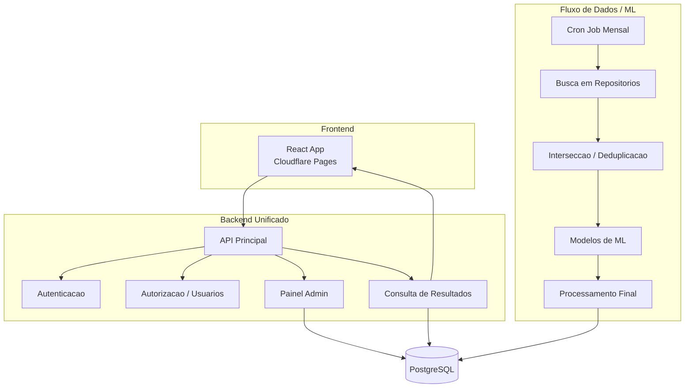

# ROADMAP

## Fase 1 — Estrutura Base

**Objetivo:** Fundacao tecnica do projeto — estrutura, dominio e autenticacao.

| ID   | Feature                                    | Tamanho | Status  |
|------|--------------------------------------------|---------|---------|
| F-01 | Setup do projeto Django + estrutura modular | Medium  | Done    |
| F-02 | Modelagem inicial do dominio (entidades)    | Medium  | Done    |
| F-03 | Autenticacao e autorizacao (JWT/session)    | Large   | Pending |
| F-04 | Setup do frontend React + integracao base   | Medium  | Pending |

### Entidades esperadas (fase 1)

- Usuario
- Papel/Perfil
- Permissao

---

## Fase 2 — Consulta e Administracao

**Objetivo:** Endpoints de leitura, gestao de usuarios e painel admin.

| ID   | Feature                                          | Tamanho | Status  |
|------|--------------------------------------------------|---------|---------|
| F-05 | Endpoints de consulta de resultados               | Medium  | Pending |
| F-06 | Busca e filtros sobre resultados                  | Medium  | Pending |
| F-07 | Gestao de usuarios e permissoes (admin)           | Large   | Pending |
| F-08 | Configuracao administrativa do pipeline           | Large   | Pending |
| F-09 | Controle de visibilidade dos resultados           | Medium  | Pending |

### Entidades esperadas (fase 2)

- Resultado processado
- Status de visibilidade do resultado
- Configuracao de pipeline

---

## Fase 3 — Integracao do Pipeline

**Objetivo:** Conectar o fluxo de dados/ML ao sistema, com persistencia e agendamento.

| ID   | Feature                                          | Tamanho | Status  |
|------|--------------------------------------------------|---------|---------|
| F-10 | Integracao do fluxo de dados/ML ao projeto        | Complex | Pending |
| F-11 | Persistencia estruturada dos resultados no banco  | Medium  | Pending |
| F-12 | Registro de execucoes do pipeline                 | Medium  | Pending |
| F-13 | Agendamento periodico (cron job mensal)           | Medium  | Pending |

### Entidades esperadas (fase 3)

- Execucao de pipeline
- Log operacional

---

## Fase 4 — Refinamento Operacional

**Objetivo:** Observabilidade, UX admin e ajustes de performance.

| ID   | Feature                                          | Tamanho | Status  |
|------|--------------------------------------------------|---------|---------|
| F-14 | Logs e observabilidade basica                     | Medium  | Pending |
| F-15 | Melhorias na experiencia administrativa           | Medium  | Pending |
| F-16 | Ajustes de performance                            | Medium  | Pending |
| F-17 | Refinamento tecnico de decisoes de implementacao  | Small   | Pending |

---

## Questoes em Aberto

Estas questoes devem ser resolvidas progressivamente durante o desenvolvimento:

- [ ] Estrategia de autenticacao (JWT, session, OAuth?)
- [ ] Primeira versao permite reexecucao manual do pipeline pelo admin?
- [ ] Fluxo de aprovacao manual antes da publicacao de novos resultados?
- [ ] Conjunto minimo de filtros na interface de consulta?
- [ ] Politica de atualizacao: sobrescrita completa, versionamento ou incremental?
- [ ] Quais componentes iniciar como interfaces genericas para posterior especializacao?

## Diagrama de Arquitetura

## Modulos do Sistema

| Modulo                        | Responsabilidade                                              |
|-------------------------------|---------------------------------------------------------------|
| Autenticacao e Autorizacao    | Login, sessoes/tokens, perfis, controle de acesso             |
| Administracao                 | Usuarios, permissoes, parametros de busca, regras, resultados |
| Consulta                      | Servir resultados processados ao frontend                     |
| Pipeline                      | Fluxo de atualizacao dos dados (coleta, ML, persistencia)     |
| Agendamento e Execucao        | Cron job mensal, execucoes manuais, registro de execucoes     |
