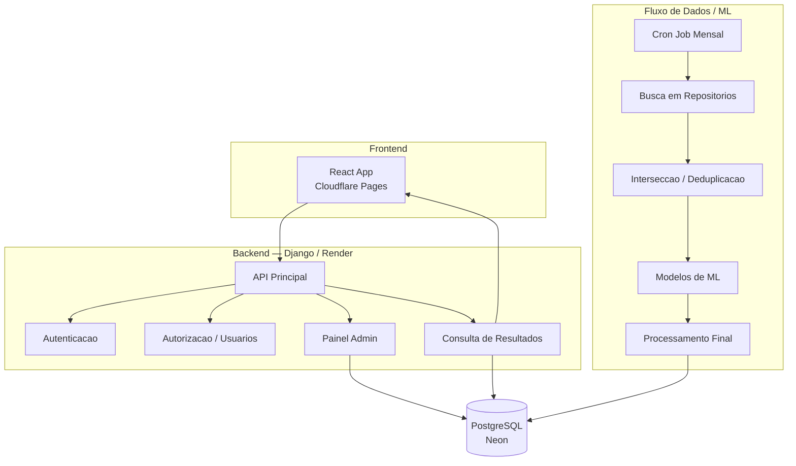

# api-petrobras

Plataforma de monitoramento e curadoria com pipeline de dados/ML. Backend Django servindo API REST, com frontend React em repositorio separado.

## Arquitetura



## Stack

| Camada   | Tecnologia        | Hospedagem       |
|----------|-------------------|------------------|
| Frontend | React             | Cloudflare Pages |
| Backend  | Django + DRF      | Render           |
| Banco    | PostgreSQL 16     | Neon             |
| Pipeline | Python (ML/Dados) | Mesmo backend    |

## Requisitos

- Python 3.12+
- PostgreSQL 16
- [uv](https://docs.astral.sh/uv/) (gerenciador de pacotes)
- Docker (para o banco local)

## Setup

```bash
# Primeiro uso: sobe o banco, instala dependencias e roda migracoes
make setup

# Servidor de desenvolvimento
make dev
```

## Comandos

| Comando         | Descricao                          |
|-----------------|------------------------------------|
| `make setup`    | Setup completo (DB + deps + migrate) |
| `make dev`      | Sobe DB + servidor de desenvolvimento |
| `make test`     | Roda testes com pytest             |
| `make lint`     | Verifica lint com ruff             |
| `make format`   | Corrige lint e formatacao          |
| `make migrate`  | Cria e aplica migracoes            |

## Endpoints

| Metodo | Rota           | Descricao                              | Autenticacao |
|--------|----------------|----------------------------------------|--------------|
| GET    | `/api/health/` | Health check simples                   | Nao          |
| GET    | `/api/status/` | Status detalhado dos componentes       | Nao          |

## Estrutura do Projeto

```
config/                 # Configuracao Django
  settings/
    base.py             # Settings compartilhados
    dev.py              # Desenvolvimento
    prod.py             # Producao
apps/                   # Django apps (prefixo apps.*)
  core/                 # App principal (health, status)
.specs/                 # Documentacao e especificacoes do projeto
```

## Deploy (Render)

| Configuracao             | Valor                                  |
|--------------------------|----------------------------------------|
| Build command            | `./build.sh`                           |
| Start command            | `gunicorn config.wsgi:application`     |
| Variaveis de ambiente    | `SECRET_KEY`, `DATABASE_URL`, `DJANGO_SETTINGS_MODULE=config.settings.prod`, `ALLOWED_HOSTS` |

## Convencoes

- **TDD obrigatorio** — testes antes da implementacao
- **Idioma** — codigo e commits em ingles, documentacao em portugues
- **Linter/formatter** — ruff
- **Pacotes** — sempre via uv, nunca pip
- **Apps** — criados em `apps/` com `name = "apps.<nome>"` no `apps.py`
